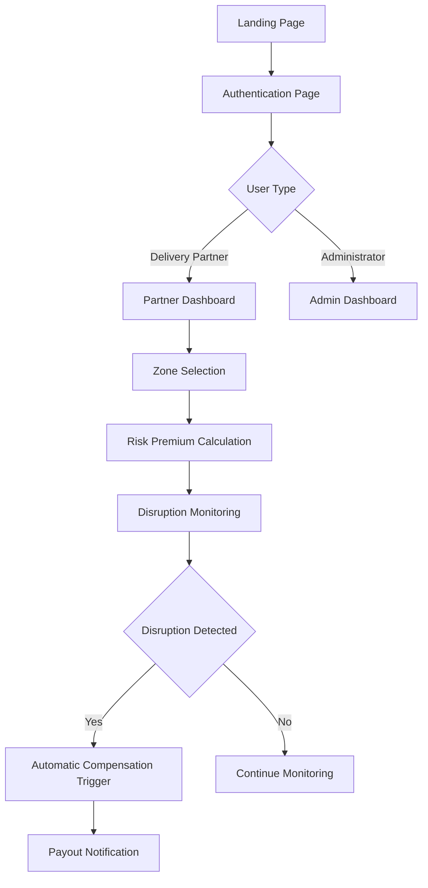

# OmniSight AI - Frontend

### AI-Powered Income Protection for India's Gig Delivery Workforce

Protecting delivery partners from income loss caused by external disruptions using AI-powered parametric protection.

Hackathon Prototype • AI + Parametric Insurance • Gig Economy Protection

---

Frontend built with  
React • TailwindCSS • AI-Driven Risk Monitoring

# Note
This repository contains the **frontend interface** for the OmniSight AI platform.  
It provides the user-facing experience for gig delivery partners and administrators to interact with the AI-powered parametric income protection system.

The frontend is built to demonstrate the **core user journey** of the platform during the hackathon prototype.

---

# Frontend Overview

The frontend focuses on three primary goals:

1. **Explain the platform value clearly**
2. **Allow workers to onboard easily**
3. **Provide dashboards for monitoring protection status**

The UI is designed for:

- Gig delivery partners
- Platform administrators

It emphasizes:

- Simplicity
- Accessibility
- Fast onboarding
- Mobile responsiveness

---

# Frontend User Flow
## System Interaction Flow

The frontend follows a simple and intuitive workflow.

---

# Landing Page

The landing page introduces the OmniSight AI platform and communicates the value proposition.

### Purpose

- Explain the problem faced by gig delivery workers
- Introduce the AI-powered solution
- Encourage users to sign up or log in

### Key Sections

#### 1. Navigation Bar

Provides quick access to core sections and authentication.

**Navigation Links**

- Solutions
- Risk Models
- Pricing

**Authentication Actions**

- Log In
- Sign Up

---

#### 2. Hero Section

The hero section delivers the primary message of the platform.

**Headline**

**Supporting Message**

The platform introduces **AI-powered parametric protection** for gig delivery workers where payouts are automatically triggered when external disruptions occur.

**Primary Call-To-Action**

This button redirects users to the authentication page.

**Secondary Action**

This is intended to showcase the system workflow during demos.

---

#### 3. Platform Value Proposition

The landing page highlights that OmniSight AI provides:

- AI-powered risk detection
- Automatic disruption monitoring
- Instant compensation triggers
- Zero manual claims

---

# Feature Section

The feature grid explains **how the system protects delivery workers**.

### Section Title

### Core Features

#### Real-Time Disruption Monitoring

The system continuously monitors external data sources including weather systems, traffic congestion, and urban disruptions to detect conditions that may prevent deliveries.

---

#### Hyper-Local Premium Modeling

Premiums are calculated dynamically based on historical risk patterns in the selected delivery zone, ensuring affordable and fair pricing.

---

#### AI-Powered Trigger Engine

When disruption thresholds are exceeded, the AI engine automatically triggers compensation without requiring workers to submit claims.

---

#### Seamless Weekly Payments

The platform aligns with the gig economy's weekly payout structure. Any triggered compensation is processed within the same payout cycle.

---

#### Autonomous Fraud Verification

Machine learning models validate GPS signals, event data, and delivery activity to prevent fraudulent claims.

---

#### Regulatory-Ready Compliance

The system is designed to align with evolving microinsurance regulations and can integrate with formal insurance providers.

---

# Authentication System

The authentication module allows users to securely access the platform.

### Supported Roles

The system supports two user types:

1. **Delivery Partner**
2. **Platform Administrator**

---

## Authentication Flow

---

## Partner Authentication

Delivery partners can:

- Register an account
- Log in to an existing account

### Partner Registration Data

Typical onboarding information includes:

- Name
- Phone Number
- Delivery Platforms
- Operating City
- Delivery Zones

After registration, the partner is redirected to the **Partner Dashboard**.

---

## Admin Authentication

Admins can log in to manage the system.

Admin access allows monitoring of:

- Disruption events
- AI trigger activity
- Platform usage
- System payouts

---

# Partner Dashboard

The Partner Dashboard provides delivery workers with visibility into their protection status.

### Core Dashboard Features

#### Protection Status

Displays whether the partner currently has active income protection.

---

#### Delivery Zone Selection

Partners can select the zones where they typically operate.

This allows the AI system to calculate **zone-specific risk profiles**.

---

#### Weekly Premium Overview

Shows:

- Current premium amount
- Risk level of selected zone
- Weekly protection status

---

#### Disruption Alerts

Displays alerts when disruptions occur in the partner’s delivery area.

Example events:

- Heavy rainfall
- Severe traffic congestion
- Restricted delivery zones

---

#### Compensation Status

If a disruption triggers a payout, the dashboard displays:

- Triggered event
- Compensation amount
- Payment status

---

# Admin Dashboard

The Admin Dashboard is designed to monitor system performance and platform activity.

### Admin Capabilities

Admins can monitor:

- Real-time disruption detection
- Triggered compensation events
- Risk model outputs
- Platform analytics

---

### Admin Features

#### Disruption Monitoring Panel

Displays incoming disruption signals from:

- Weather APIs
- Traffic APIs
- Urban event feeds

---

#### Triggered Claim Monitoring

Shows when the AI engine triggers compensation events.

Information displayed includes:

- Affected zone
- Event type
- Number of affected partners

---

#### System Risk Overview

Displays risk patterns across different zones based on:

- historical weather events
- traffic disruptions
- prior trigger frequency

---

# Frontend Technology Stack

The frontend is built using modern web technologies.

| Technology | Purpose |
|-------------|--------|
| React | Component-based UI framework |
| TailwindCSS | Utility-first styling framework |
| React Router | Client-side routing |
| Lucide Icons | Modern UI icon library |

---

# Component Structure

Example simplified structure of the frontend project.

---

# Routing Flow

The application uses client-side routing to manage navigation.

Example routes:

---

# Design Philosophy

The frontend is designed with the following principles:

### Simplicity

Gig workers should be able to understand and use the platform instantly.

---

### Mobile Accessibility

Many delivery partners primarily use smartphones.  
The UI is responsive and optimized for small screens.

---

### Clear Risk Communication

Workers should easily understand:

- risk level
- premium amount
- disruption alerts

---

This frontend demonstrates the **core concept** of OmniSight AI.

The prototype focuses on:

- showcasing the platform workflow
- demonstrating automated income protection
- visualizing disruption-triggered payouts

---

# License

This project is developed for **innovation and research purposes** and can be extended into a production-grade system with regulatory approvals.
MIT License
